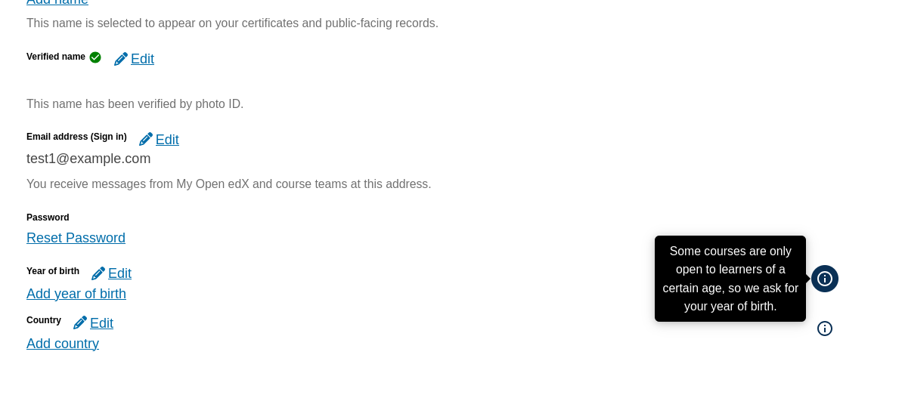
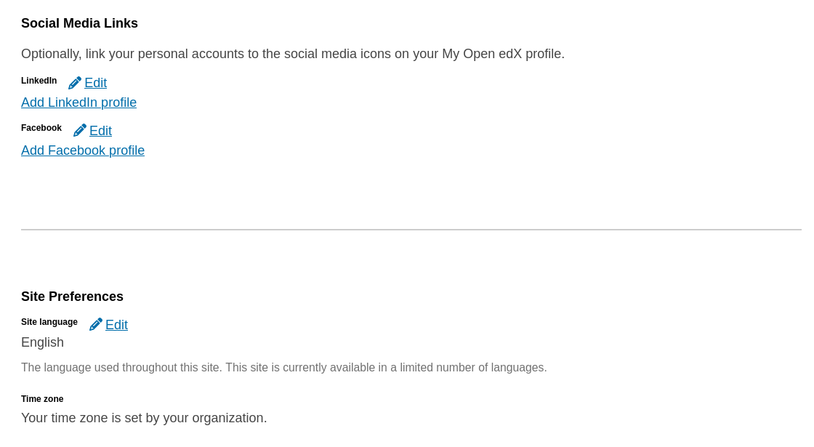

# Account Settings Field

### Slot ID: `org.openedx.frontend.account.settings_field.v1`

## Description

This slot wraps every field on the account settings page, whichever section it is in, from `username` and `email` to `year_of_birth`, the social links and `time_zone`. It is one slot id shared by every field, and plugins tell the fields apart by the `fieldName` prop. The slot is rendered by the `EditableField`, `EditableSelectField` and `EmailField` components, so a field added to the page with one of them is covered too.

The default content is the field itself. Set `keepDefault: true` on the slot, or the field is replaced by the plugins.

What a plugin can do with it:

* **Add a component next to a field.** Insert a widget and render something for the fields it cares about, based on `fieldName` and `value`: a hint, a link to a help page, a badge, or a note that the field needs completing. An inserted widget renders under the field; to place one beside it, for example an info icon that opens a tooltip or overlay explaining why the field is collected, use a Modify operation as shown below.
* **Style or scroll to a field.** Each field is rendered inside a `<div data-account-settings-field="{fieldName}">` container, so an inserted widget can find the field it belongs to, for example to highlight it or scroll it into view.
* **Hide or replace one field.** Use a Modify operation on `default_contents`, as shown below. The operation runs once per field, and `widget.RenderWidget.props.fieldName` says which one. A replacement receives `fieldName` and `value` as props, but no way to save, so it can only display.

## Examples

### Add a component beside a field

An inserted widget renders after the field, so it lands under it. To place something beside a field, use a Modify operation that renders the original field, `widget.RenderWidget`, next to your component.

The following `env.config.jsx` uses the example `addFieldInfo` function. It adds an info button with a tooltip beside the year of birth and country fields, explaining why they are collected, and leaves every other field as it is.



```jsx
import { PLUGIN_OPERATIONS } from '@openedx/frontend-plugin-framework';
import { addFieldInfo } from './src/plugin-slots/AccountSettingsFieldSlot/example';

const config = {
  pluginSlots: {
    'org.openedx.frontend.account.settings_field.v1': {
      // Keep the field itself; a slot entry without this replaces it.
      keepDefault: true,
      plugins: [
        {
          op: PLUGIN_OPERATIONS.Modify,
          widgetId: 'default_contents',
          fn: addFieldInfo,
        },
      ],
    },
  },
};

export default config;
```

### Hide or replace one field

Hide and Wrap operations apply to every field in the slot. To act on a single field, return a changed widget from a Modify operation for that field only, and the widget unchanged for the rest.

The following `env.config.jsx` uses the example `hideOrReplaceField` function. It hides the X (Twitter) link and replaces the time zone field with a notice, and leaves every other field as it is.



```jsx
import { PLUGIN_OPERATIONS } from '@openedx/frontend-plugin-framework';
import { hideOrReplaceField } from './src/plugin-slots/AccountSettingsFieldSlot/example';

const config = {
  pluginSlots: {
    'org.openedx.frontend.account.settings_field.v1': {
      keepDefault: true,
      plugins: [
        {
          op: PLUGIN_OPERATIONS.Modify,
          widgetId: 'default_contents',
          fn: hideOrReplaceField,
        },
      ],
    },
  },
};

export default config;
```

## Plugin Props

### `fieldName`
- **Type**: String
- **Description**: The field this slot wraps, as the page names it, for example `year_of_birth`. This is the accounts API name for every field except the site language, which is `siteLanguage`.

### `value`
- **Type**: String, Number, Boolean or Array
- **Description**: The field's current value. It is empty (`null`, `''` or `[]`) when the learner has not filled it in.
