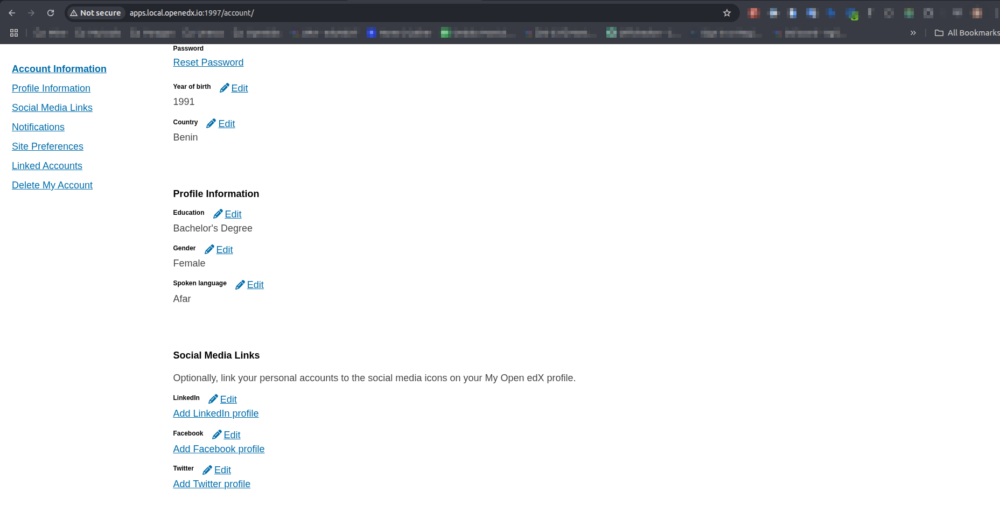

# Extended Profile Fields

### Slot ID: `org.openedx.frontend.account.extended_profile_fields.v1`

### Slot ID Aliases
* `extended_account_fields_slot`

## Description

This slot is used to replace/modify/hide the extended profile fields in the account page.

## Example

> [!NOTE]
> Take into account that the fields shown in the screenshots come from a [custom NPM Package](https://www.npmjs.com/package/@edunext/frontend-component-extended-fields) 

The following `env.config.jsx` will replace the default custom fields. 



with a custom extended fields component


```jsx
import { DIRECT_PLUGIN, PLUGIN_OPERATIONS } from '@openedx/frontend-plugin-framework';

import { ExtendedProfileFields } from '@organization/frontend-component-extended-fields';

const config = {
	pluginSlots: {
		extended_account_fields_slot: {
			keepDefault: false,
			plugins: [
				{
                    // Insert a custom ExtendedProfileFields component
					op: PLUGIN_OPERATIONS.Insert,
					widget: {
						id: 'extended_account_fields',
						type: DIRECT_PLUGIN,
						RenderWidget: ExtendedProfileFields,
					},
				},
			],
		},
	},
};

export default config;
```
