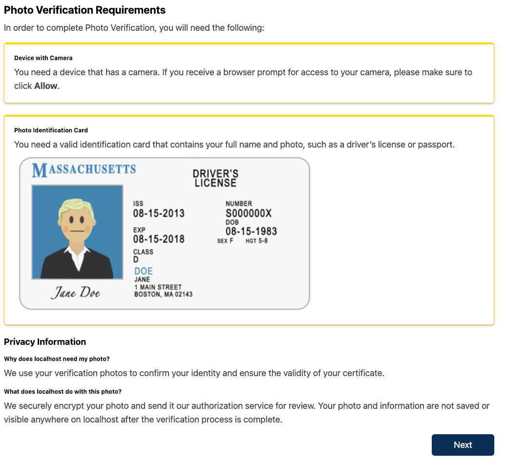

# Footer Slot

### Slot ID: `id_verification_page_plugin`

## Description

This slot is used to replace/modify the IDV Page.

The implementation of the `IdVerificationPageSlot` component lives in `src/plugin-slots/IdVerificationPageSlot/index.jsx`.

## Example

The following `env.config.jsx` will replace the default IDV Page.



```jsx
import { DIRECT_PLUGIN, PLUGIN_OPERATIONS } from '@openedx/frontend-plugin-framework';

const config = {
  pluginSlots: {
    id_verification_page_plugin: {
      plugins: [
        {
          // Insert a custom IDV Page
          op: PLUGIN_OPERATIONS.Insert,
          widget: {
            id: 'id_verification_page_plugin',
            type: DIRECT_PLUGIN,
            RenderWidget: () => (
              <div>
                <p>This is the new IDV page</p>
                <a href="/">Go Home</a>
              </div>
            ),
          },
        },
      ],
    },
  },
};

export default config;

```
