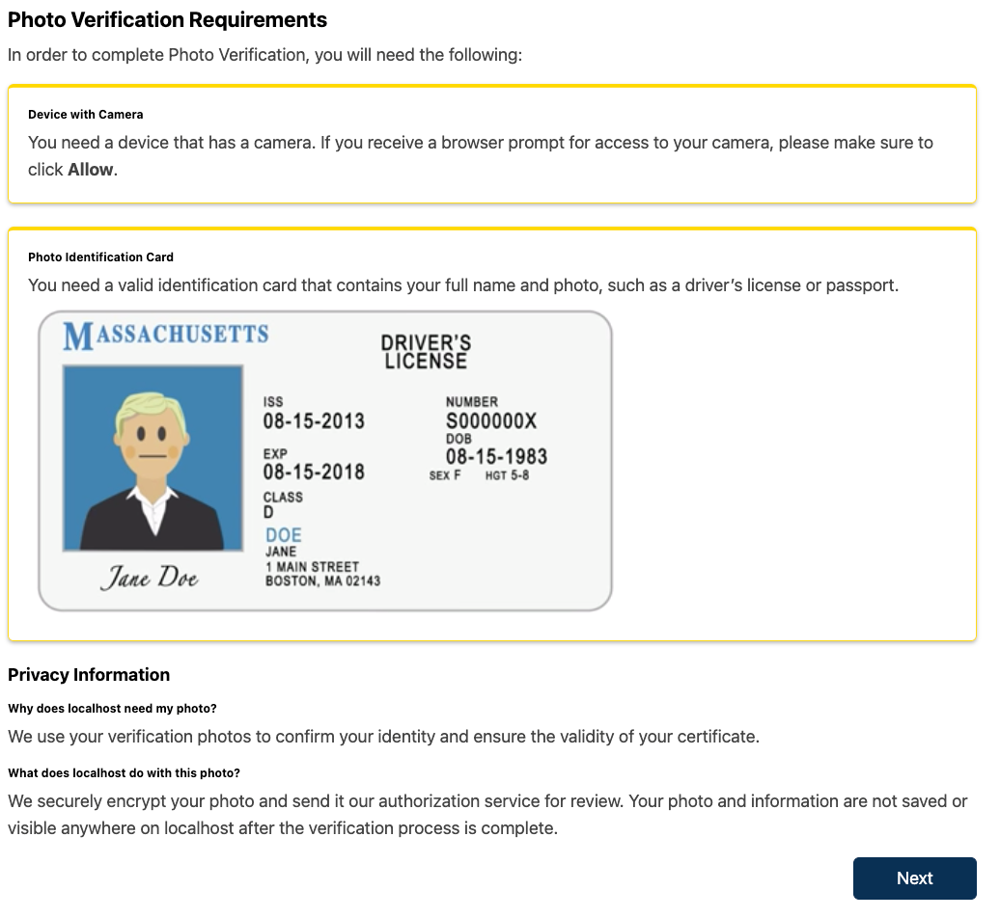

# ID Verification Page Slot

### Slot ID: `org.openedx.frontend.slot.account.idVerificationPage.v1`

## Description

This slot is used to replace/modify the IDV Page.

The implementation of the `IdVerificationPageSlot` component lives in `src/slots/IdVerificationPageSlot/index.tsx`.

## Example

The following `site.config` will replace the default IDV Page.



```jsx
import { WidgetOperationTypes } from '@openedx/frontend-base';

const siteConfig = {
  // ...
  slots: [
    {
      // Replace the default IDV Page with a custom one
      slotId: 'org.openedx.frontend.slot.account.idVerificationPage.v1',
      id: 'custom_id_verification_page',
      op: WidgetOperationTypes.REPLACE,
      relatedId: 'defaultContent',
      element: (
        <div>
          <p>This is the new IDV page</p>
          <a href="/">Go Home</a>
        </div>
      ),
    },
  ],
};

export default siteConfig;
```
